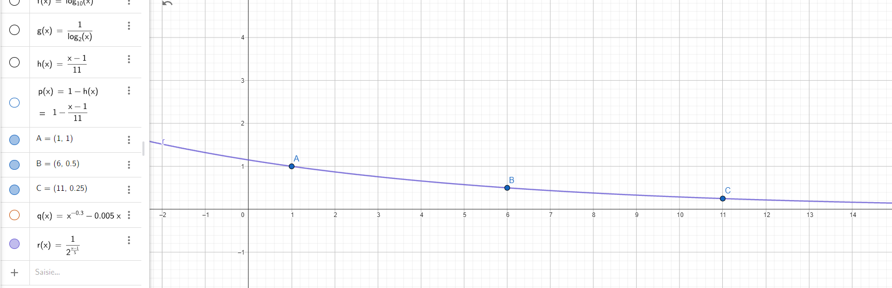

<h1 align="center">TP PROJET SR  HAGAR.IO FRONTEND </h1>

   
   
    
   
   

<h3 align="left">
    <b>Autors : </b> <a href="https://github.com/Thomega35/">Thomas DELAPART</a> & <a href="https://github.com/Xacone">Yazid BENJAMAA</a>
</h3>

> Le client du projet déployé sur Vercel est disponible à l'adresse : [sr.thomega.fr](https://sr.thomega.fr/)
> 
> Nos rapports individuels les deux fichiers [rapport_thomas_delapart.md](rapport_thomas_delapart.md) et [rapport_yazid_benjamaa.pdf](rapport_yazid_benjamaa.pdf) qui sont disponibles à la racine du projet.

# Développement du Projet 🤖 

- Pour ce projet, nous sommes partis d'une base générée avec [t3.create](https://create.t3.gg/) nous permettant d'avoir une base pour le développement de notre projet avec les technologies suivantes : 
  - [Next.js](https://nextjs.org)
  - [Tailwind CSS](https://tailwindcss.com)
  - [Typescript](https://www.typescriptlang.org)
  - [React](https://reactjs.org)
- Nous avons ensuite développé la fonctionnalité de profil utilisateur, afin de person,aliser son nom.
- Ensuite, nous avons développé la partie graphique du jeu, avec un canva, le dessin des joueurs et de la nourriture.
- Nous nous sommes ensuite occupés de la logique du jeu, avec la gestion des collisions, des déplacements, de la consommation de la nourriture.
- Enfin, nous avons ajouté le back-end pour gérer la liste des joueurs connectés, la nourriture commune à tous les joueurs, et la communication en temps réel entre les joueurs.
- Nous avons fini par l'ajout d'un écran des scores, un écran de fin de partie, et la correction de quelques bugs.

# Description du projet 📝

- Le projet est un jeu multijoueur en ligne, le but est de manger les autres joueurs pour devenir le plus gros possible.

# Communication avec le back📡

- Le projet utilise une API REST pour communiquer avec le back et la librairie [Socket.io](https://socket.io/) pour la communication en temps réel.

## Learn More

To learn more about the [T3 Stack](https://create.t3.gg/), take a look at the following resources:

- [Documentation](https://create.t3.gg/)
- [Learn the T3 Stack](https://create.t3.gg/en/faq#what-learning-resources-are-currently-available) — Check out these awesome tutorials

You can check out the [create-t3-app GitHub repository](https://github.com/t3-oss/create-t3-app) — your feedback and contributions are welcome!

## How do I deploy this?

Follow our deployment guides for [Vercel](https://create.t3.gg/en/deployment/vercel), [Netlify](https://create.t3.gg/en/deployment/netlify) and [Docker](https://create.t3.gg/en/deployment/docker) for more information.

