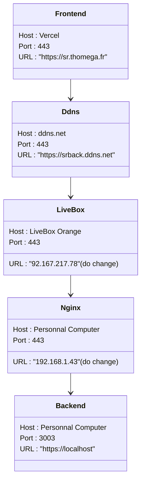

<h1 align="center">TP PROJET SR  HAGAR.IO FRONTEND </h1>

<p align="center">
   
   
    
   
   
</p>
<h3 align="left">
    <b>Autors : </b> <a href="https://github.com/Thomega35/">Thomas DELAPART</a> & <a href="https://github.com/Xacone">Yazid BENJAMAA</a>
</h3>


> Le client du projet déployé sur Vercel est disponible à l'adresse : [sr.thomega.fr](https://sr.thomega.fr/)
>
> Le backend du projet déployé sur ma machine personnelle est dans ce repository : [Hagar.io_Backend](https://github.com/Thomega35/SR_HAGAR.IO_BACK)
> 
> Nos rapports individuels les deux fichiers [rapport_thomas_delapart.pdf](rapport_thomas_delapart.pdf) et [rapport_yazid_benjamaa.pdf](rapport_yazid_benjamaa.pdf) qui sont disponibles à la racine du projet.

# Présentation du Projet 🤖 

Le projet Hagar.io est un jeu multijoueur en temps réel, où le but est d'occuper la première place du classement en augmentant son score le plus possible sans mourir. 

Pour cela, le joueur doit manger des boules de nourriture qui apparaissent aléatoirement sur la carte, et éviter les autres joueurs qui peuvent le manger et manger les joueurs plus petits que lui.

Les fonctionnalités de ce jeu sont les suivantes :
- Personnalisation du nom du joueur
- Canva interactif avec la souris pour déplacer le joueur
- Fonctionnalité de manger la nourriture
- Interaction en temps réel avec les autres joueurs
- Fonctionnalité de nourriture empoisonnée pour les joueurs les plus gros
- Classement des joueurs en temps réel
- Anti-triche pour assurer l'équité du jeu
- Mode spectateur après la mort du joueur

# Commandes utiles 📜

```bash
# Installation des dépendances
npm i
# Lancement du projet en mode développement
npm run dev
# Lancement des tests d'intégration
npm run test
# Génération de la version de production
npm run build
# Lancement de la version de production
npm run start
(Le projet est aussi toujours disponible à l'adresse : https://sr.thomega.fr/))
```
# Aspect Technique du projet 📝

- Pour ce projet, nous sommes partis d'une base générée avec [t3.create](https://create.t3.gg/) nous permettant d'avoir une base pour le développement de notre projet avec les technologies suivantes : 
  - [Next.js](https://nextjs.org)
  - [Tailwind CSS](https://tailwindcss.com)
  - [Typescript](https://www.typescriptlang.org)
  - [React](https://reactjs.org)
- Le projet est automatiquement redéployé sur [Vercel](https://vercel.com) à chaque commit pour une mise en production rapide et efficace.
- Une série de tests d'intégration est aussi lancée à chaque commit pour s'assurer du bon fonctionnement de la non-régression du projet.
- L'équilibrage du jeu a été soigneusement étudié pour assurer une expérience de jeu équitable pour tous les joueurs. On peut voir ici la réflexion sur de la vitesse de déplacement des joueurs en fonction de leur taille.


# Particularités du projet 🎮

L'une des particularités de ce projet est que la totalité des calculs du jeu sont effectués côté client pour une expérience de jeu fluide et réactive. Le serveur ne sert que pour la communication entre les joueurs et la mise à jour des scores. (Toutefois, le serveur est capable de gérer les cas de triches et les mises à jour des scores en cas de déconnexion du joueur.)

Notre serveur est donc bien plus léger qu'un jeu orchestré par un serveur et peut supporter un grand nombre de joueurs simultanément. Cette information a été validée par des tests de charge effectués.


# Architecture du projet 🏗️

```
┌─ .github/workflows/
│      └─ playwright.yml
├─ src/
│  ├─ app/
│  │  └─ profile/
│  │     ├─ canvas.tsx
│  │     ├─ layout.tsx
│  │     └─ page.tsx
│  ├─ components/
│  │  ├─ name-context.tsx
│  │  └─ navbar.tsx
│  └─ lib/
│     ├─ Game.tsx
│     ├─ Mouse.tsx
│     └─ tickUpdater.tsx
└─ tests/
   ├─ front.spec.ts
   └─ multiUser.spec.ts

```


# Communication avec le back📡

- Le projet utilise une API REST pour communiquer avec le back et la librairie [Socket.io](https://socket.io/) pour la communication en temps réel.
- Voici un schéma de l'architecture de communication entre le frontend de Vercel et le backend sur ma machine personnelle avec les ports et les URL associées.


